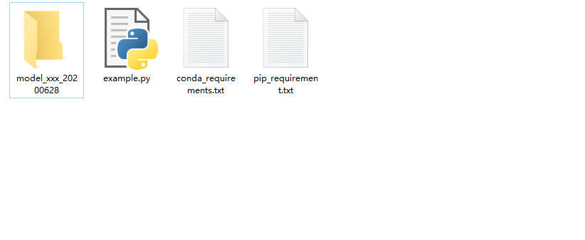

# 商品鉴定模型上线移交标准
--------------------------------------------------------------

```
移交模型包括两部分
  1.上线模型代码 (如包含cython转换的的c文件请给出编译脚本，so文件请标明编译平台)
  2.训练模型的源代码(确保可以再次训练，请不要用cython加密，方便以后留给小师弟小师妹学习)

训练模型的数据集请妥善保存，备份后留下文档，文档中标明结构目录和使用注意事项等。
```

## 1.上线模型目录标准
> ### 移交文件包括四个：

> #### 1. 'model_模型名称_日期'  文件夹
>> ###### 所有模型代码文件存放于此文件夹内，尽可能保证文件结构干净，移除无用文件、测试图片等
>> ###### 例如：model_BurberryMarkFilter_20200628

> #### 2. example.py
>> ###### 1.封装好 模型类对象 对外提供 init 和 test 两个函数
>> ###### 2.example.py 中尽可能只保留这五行代码
> ###### 模型调用示例
```
from model_xxx_20200628 import model_xxx
if __name__ == '__main__':
    model = model_xxx()
    model.init('模型文件路径')
    model.test('xxx.jpg')
```

> #### 3. conda_requirements.txt 与 pip_requirement.txt
>> ###### pip 或 conda依赖库安装文件

--------------------------------------------------------------

## 2.训练模型源代码
请确保代码可运行，其他暂无要求

## 3.关于模型实验环境
#### 上次浩远老师组织开会讨论过一次python常用依赖库版本标准地址如下，组内在做实验时尽可能按照这个标准吧！ (另 模型代码中如有c文件请给出编译脚本)
https://www.yuque.com/docs/share/2c411d8e-457b-475e-9dbd-cc136b320328?#
